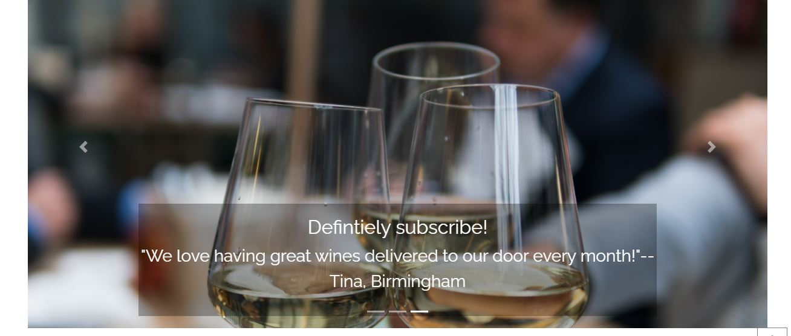

# Milestone 4 : Wine Nation 

As this is the final Milestone project of Code Institute's Full stack web developer course, my aim was to create a full-stack site based around business logic used to control a centrally owned dataset and to provide paid access to the site's data and services.

The project is an Ecommerce site for a wine shop specializing in Eastern European wines, which also has a subscription-based wine delivery service that allows shoppers to purchase wines at a better price than buying individual bottles, the longer the subscription period the lower the price per bottle.

Please see the link to the live page here: https://winenation.herokuapp.com/

## Table of Contents

1. [**UX**](#ux)
    - [**Project goals**](#project-goals) 
    - [**User Stories**](#user-stories)
    - [**Design**](#design)
    - [**Wireframes**](#wireframes)
2. [**Features**](#features)
    - [**Existing Features**](#existing-features)
    - [**Features Left to Implement**](#features-left-to-implement)
3. [**Information architecture**](#information-architecture)
    - [**Database choice**](#databse-choice)
    - [**Data modelling**](#data-modelling)
4. [**Technologies Used**](#technologies-used)
    - [**Languages**](#languages)
    - [**Libraries and Frameworks**](#libraries-and-frameworks)
    - [**Tools**](#tools)
    - [**Databases**](#databases)
    - [**Version Control**](#version-control)
    - [**Hosting**](#hosting)
5. [**Testing**](#testing)
    - [**Validation**](#validation)
    - [**Manual Testing**](#manual-user-testing)
    - [**Automated Testing**](#automated-testing)
    - [**Problems encountered**](#problems-encountered)
6. [**Deployment**](#deployment)
    - [**Local Deployment**](#local-deployment)
    - [**Heroku Deployment**](#heroku-deployment)
7. [**Credits**](#credits)
    - [**Code**](#code)
    - [**Content**](#content)
    - [**Acknowledgements**](#acknowledgements)

## UX

### Project goals 

#### Target audience: 

- Wine lovers
- Eastern European Immigrants looking for their favourite wines
- People who are organizing a party
- People who like to experiment and try out new things
- People who are regular wine drinkers and would like to receive wine by post on a regulat basis

#### Site owner's goals:

- Promote their shop
- Generate more business through the webhop and the subscription service
- Attract more suppliers 
- Popularize wine from this lesser known region

#### Visitor's goals

- Purchase products shown on the website in a safe and secure way
- Learn about the subscription options

### User stories

**Viewing and navigation**

As a user I want to be able to view a list of wines and decide what to purchase and select them.

As a user I want to be able to view individual product details and find description, price, image.

As a user I want to be able to identify deals and offers easily, take advantage of savings and discounts.

As a user I want to be able to view what services the company's offering.

As a user I want to learn more about the company and the purpose of the site.	

As a user I want to be able to easily register for a personal account to see my profile and order history.

As a user I want to be able to easily log in and out of my personal account.

As a user I want to be able to recover my password so I can have access to my account even if I forgot my password.

As a user I want to receive an email confirmation after registering in order to verify my account has been created.

As a user I want to be able to save and update my payment information, delivery and billing address, see order history and current subscription.
	
**Sorting and searching**

As a user I want to be able to sort a category of products, find the best priced products in a category, or sort the products in the category alphabetically.

As a user I want to be able to sort multiple categories of products simultaneously.

As a user I want to be able to search for a product by name or description.

As a user I want to be able to easily see what I've searched for and the number of results	.
			
**Purchasing and checkout**

As a user I want to be able to easily select the quantity of the product when purchasing it to ensure I don't accidentally select the wrong product or quantity.

As a user I want to be able to view items in my bag to identify total cost of purchase, price and number of items I am going to buy.

As a user I want to be able to adjust the quantity of individual items in the bag in order to make changes to my purchase.

As a user I want to be able to easily enter payment information to be able to check out quickly.

As a user I want to feel my personal and payment information is stored securely	so that I can happily provide sensitive information needed for checkout.

As a user I want to be able to view an order confirmation after checkout	to verify I haven't made a mistake.

As a user I want to be able to receive an email confirmation after checkout so that I have a confirmation for the record.
			
**Admin and store management**	

As a store owner I want to be able to add a product or subscription to the shop to extend the range of items for sale if needed.

As a store owner I want to be able to edit/update products, change product details such as price, description.

As a store owner I want to be able to delete products  to avoid I don’t advertising items that are no longer available and misleading customers.

### Design

I used the Bootstrap front-end framework throughout the development process, mainly for features such as navbar, cards, modals, carousel and the grid layout.

The website's colour scheme is in line with  the theme of the site with black and grey added for contrast. It is dominated by reds, yellow and pink to reflect the colours of red, white and rose wines.

I am using a simple sans-serif font from Google Fonts called Raleway to create a modern look and and easy to read website.

The website is responsive and works well on all viewports.

For more images click [here](https://github.com/KittiKovacs/winenation/blob/8c938122853a6ecc76094801e43e024f68bbcac3/wireframes/responsive_images)

### Wireframes

Wireframes for desktop, tablet and mobile can be found [here](https://github.com/KittiKovacs/winenation/tree/master/wireframes).

The final website is slightly different from what I had in mind originally, as sometimes I found a different solution would be more suitable.

## Features

### Existing Features

#### Age verification

When visiting the website the user is first asked to verify if they are over 18 years of age which is the legal age to purchase alcohol in the UK.
This is to ensure that no underage user can purchase wine online.

If the user clicks "YES" the webste's landing page will display. If the user clicks no, the only option the site offers is to close the page.

#### navigation

On the top of the page the user can find the main navigation elements, such as the menu items, bag and profile icons and search bar.

In the center of the page there's the logo and a slogan underneath. On clicking the logo the user can navigate back to the homepage from any site on medium and large screens.
Some navigation elements have sub-elements which open in a dropdown, such as the wines page and the profile icon.

On mobile screens the menu items are condensed into a hamburger button and the search icon, profile and bag icons are displayed on top of the page.

On the bottom of the page users can find a footer containing links to external partner sites, social media account and
the shop's physical address and contact details.

In the bottom right corner there is a an upward pointing arrow that takes the user back to the top of the page when clicked.

Another navigation feature on the all wines, red, white and sparkling and dessert wines pages is pagination which is on the bottom of the page in the middle.

#### Landing page
This is created to make a first impression to the user and also to act as a manifesto to the site. 
It features all navigation elements and also a button to take the user straight to the all wines page.

#### About us page
This page describes the purpose of the site with a short description on the top that has a scrolling image as a background,
a more details description about wines and the area, and contains an image carousel on the bottom with user reviews.
The carousel and the parallax scolling background are not displayed on small screens.

#### Wines page

This page contains 50 wines divided into 4 categories (Red, White, Rose, Dessert and Sparkling wines).
The user can view all wines on the same page or by individual categories.

If the user is on a category page, they have an option to return to the All wines page.

There is a sorting option on the top right where the user can sort products alphabetically, by category or by price.
The user is also able to search by keyword.

The products are displayed on cards that contains the product image, name and the category.
On clicking the product name the user is taken to the product's details page.

#### Wine details page

This page contains more details about the product and gives the opportunity
for the user to choose a quantity by using the quantity selector and add the product to the shopping bag.

If the item is successfully added to the bag a toast message appears on the top. This gives the user a list of what's in the bag, the product prices and a total.

It also has a link to the bag.

#### Subscriptions

The subscriptions page has a similar structure to the About page, it has a short introduction with a parallax scrolling background (visible on medium viewports and above ),
then some text describing the service and the benefits it offers to users.

Below this the user can see the subscription types to choose from, each displayed on a card with a description and price.
Here they also have a choice to adjust quantities and add the subscription type to the bag. There isn't a page for each subscription like there is for the wines,
I created one initially but I felt it was redundant and went in a different direction.

#### Shopping bag

The user is not automatically redirected to the shopping bag when placing an item in the bag. They can access it by clicking on the
button in the toast message popping up, or by clicking on the bag icon in the top right corner.

The bag page is available for both logged in and non-logged in users, so that it is possible to make purchase as a guest.

The page contains a summary of the user's order: the item's image, name, sku, quantity, price and subtotal.
Subscriptions do not have images so I set a default image to display in case there's no image associated with an item.

A user can update the item's quantity by using the quantity selector buttons, or remove items from their order. Toast messages will be displayed when a user updates/removes items in the bag.
At the bottom of the page the subtotal, delivery coast and grand total are displayed.
There is a checkout button that takes a user to the checkout page to proceed with the payment, 
and there's also an option for returning to the all wines page in case the user wants to add more items to the bag.

#### Checkout

The Checkout page contains the checkout form and the order summary.

On the right side of the page, there is the Order summary.
This includes short information about items in the order (image, name, quantity of each item in the bag, subtotal, delivery cost, total to pay.),
and a button below this that redirects the users back to the bag in case they need so make some changes. 

The checkout form on the left asks for the user's personal details and delivery address, and contains a field for the card details to be entered.
The user is can double check how much the card will be charged as the total is displayed below the Complete order button

If the user doesn't have an account or isn't logged in, there are links to the register and login pages for easier navigation.
For logged in users, a save info checkbox allows the form information to be saved to their profile. For logged in users the form will be pre-populated with this information.

The Stripe functionality is only for testing at the moment, so only entering 4242 4242 4242 4242 card number will result in successfull payment. Expiration date and CVC are 04/24 2424. This is provided by Stripe for testing purposes.
The site is using webhooks to make sure that the order is processed even if when the payment process is interrupted (e.g. if a user accidentally closes the page or browser after clicking "Proceed to payment" button).

While the payment is pending the user sees a spinner.

If the form is submitted successfully and payment was processed, the user is taken to the checkout sucesss page and a confirmation email is sent to the user's email address at the same time.
If there is something missing from the form, hints are displayed for the users on how to resolve the issue.

#### Checkout Success page

A thank you message informs the customer about the successful completion of the transaction and that they should receive a confirmation email soon.
They are also presented with a table summarizing the order details:
- Order number and date
- Shipping details
- Billing info 

A button below the table redirects user to the All wines page.
Also, a success toast message appears in the top right corner that includes the order number and confirmation email address.

### User authentication

These are all part of the Django-allauth package.

#### Register

This allows a user to create a new account. In case the user already has an account, there is a link to the login page for existing users above the form.
The Registration page is only available to non-logged in users.
The form contains fields for an email addres, email address confirmation, username, password and password (again).
When adding a username, the code compares it against existing email to ensure that it is unique.

If user's input does not meet requirements, the form displays and error. 
When the form is submitted, a verification email is sent to the user's email address to finish the registration process.

#### Login

The login page features the form with username and password fields. There are 2 buttons below the form, one for logging in and one for returning to the home page. There is also a "remember me" tickbox under the form as well as a link to the reset password feature.

If the login was successful, the user is redirected to the home page and a toast success message appears in the top right corner.
Otherwise, the form displays a message about incorrect user input.
There is also a link to the sign up page for new users above the form.

#### Profile

Logged in users are able to see their Profile which contains their saved details and order history (if any).
The page displays the username on top, delivery information to the left with a button to update this information. It is pre-populated if the user already has saved information.
To the right there is a short order history with order id, order date, items and order total.

By clicking on the order number the same table displays the user would see after a successful checkout,
and the Toast info message will tell the user that it's a past confirmation for the order number.
The back to profile page button will redirect a user to the Profile page.

#### Logout

Logged in users have the option to log out by clicking on the "logout" option underneath Profile on the top of the page.
The user is redirected to the logout page where to user has to confirm they want tolog out. 
It will end their session and a toast success message informs them about successful log out. The user is redirected to the home page.

#### Password reset

A user can reset their password to be able to login by entering the email by clicking on the Forgot password lon on the login page.
If they enter their email address and click reset passsword, a link will be sent to the email provided.
The user can create a new password and then login with a new password.

#### 404 and 500 error pages

Custom 404 and 500 pages are displayed when this error occurs which give the users a chance to return to the homepage.

#### Admin functions

The Product managment feature is available only for authenticated superusers. 

The superuser has permission to add new products by filling in the Add New Product or Edit product forms. 

By clicking on the Product management option the user can add a new product by filling in the form. They can upload a photo for each product.
By ticking "is a subscription" they are also able to create a new subscription type.

To edit a product, the superuser can click in the Edit option on the product's card. This feature is only visible for superusers.

They will be taken to the edit product page where they can overwrite the existing details and add a new image.

To delete a product the superuser can click on the delete link on the product card. This is also not visible for non-superusers.

All these changed are confirmed in the form of toast messages as well.

### Features left to implement

There are some more features that I feel would improve on the overall user experience and could be beneficial to a real-life shop owner I didn't feel important or got around to implement, but I intend to add them later.

**Rating and Customer Reviews**
At the moment users have no means to give feedback to the store owner and to each other about the product, which is a quite important feature in a modern webshop.
Users in the future would be able to create, edit and delete their reviews, and give a star (or wine glass)-based rating to each product which would display on the product details page along with the reviews.

**User uploaded photos**
This feature would allow users to add photos to their reviews as well as an avatar to their profile.

**News section**
This would be a page for the store owner to potentially post updates, news and offers to the site.

**Social account login (Google and Facebook)**
This feature would allow users to login using social networks accounts, such as Google and Facebook.

## Information architecture

### Database Choice

During the development stage I worked with Django's default sqlite3 database, which I later changed to
a PostgreSQL database which is provided by Heroku as an add-on.

### Data modelling

#### Product app

**Products**

Name | Key | Field Type | Validation
------------ | ------------- | ------------- | ------------- 
SKU | sku | models.CharField | max_length=254
Name | name | models.CharField | max_length=254
Description | description | models.TextField | ()
Price | price | models.DecimalField | max_digits=6, decimal_places=2
Image_url | image_url | models.URLField | max_length=1024, null=True, blank=True
Image | image | models.ImageField | upload_to='', null=True, blank=True
Category | category |models.ForeignKey | 'Category', null=True, blank=True, on_delete=models.SET_NULL
Winery | winery | models.CharField | max_length=254, null=True, blank=True
Country | country | models.CharField | max_length=254, null=True, blank=True
Variety | variety | models.ForeignKey | 'Variety', null=True, blank=True, on_delete=models.SET_NULL, max_length=254
Vintage | vintage | models.IntegerField | null=True, blank=True
Region | region | models.ForeignKey | 'Wine_region', null=True, blank=True, on_delete=models.SET_NULL, max_length=254
Alc_vol | alc_vol | models.DecimalField | null=True, blank=True, max_digits=6, decimal_places=2
Pairing | pairing | models.CharField | max_length=254, null=True, blank=True
Is_a_subscription | is_a_subscription | models.BooleanField | default=False

**Category**

Name | Key | Field Type | Validation
------------ | ------------- | ------------- | ------------- 
Name | name | models.CharField | max_length=254
Friendly_name | friendly_name | models.CharField | max_length=254

**Variety**

Name | Key | Field Type | Validation
------------ | ------------- | ------------- | ------------- 
Name | name | models.CharField | max_length=254
Friendly_name | friendly_name | models.CharField | max_length=254

**Wine_region**

Name | Key | Field Type | Validation
------------ | ------------- | ------------- | ------------- 
Name | name | models.CharField | max_length=254
Friendly_name | friendly_name | models.CharField | max_length=254

#### Profile app

**User Profile**

Name | Key | Field Type | Validation
------------ | ------------- | ------------- | ------------- 
User| user | models.OneToOneField | User, on_delete=models.CASCADE
Phone Number | default_phone_number | models.CharField | max_length=20, null=True, blank=True
Street Address 1| default_street_address1 | models.CharField | max_length=80, null=True, blank=True
Street Address 2| default_street_address2 | models.CharField | max_length=80, null=True, blank=True
Town or City| default_town_or_city | models.CharField | max_length=40, null=True, blank=True
County, State or Locality| default_county | models.CharField | max_length=80, null=True, blank=True
Postcode| default_postcode | models.CharField| max_length=20, null=True, blank=True
Country| default_country | CountryField| blank_label='Country', null=True, blank=True

#### Checkout app

**Order**

Name | Key | Field Type | Validation
------------ | ------------- | ------------- | ------------- 
Order number| order_number | models.CharField| max_length=32, null=False, editable=False
User Profile| user_profile | models.ForeignKey  | UserProfile, on_delete=models.SET_NULL, null=True, blank=True, related_name='orders'
Full Name | full_name | models.CharField | max_length=50, null=True, blank=True
Email| email | models.CharField | max_length=254, null=True, blank=True
Phone number | phone_number | models.CharField | max_length=20, null=False, blank=False
Country | country | CountryField| blank_label='Country *', null=True, blank=True
Postcode| postcode | models.CharField| max_length=20, null=True, blank=True
Town or City| town_or_city | models.CharField | max_length=40, null=True, blank=True
Street Address 1| street_address1 | models.CharField | max_length=80, null=True, blank=True
Street Address 2 | street_address2 | models.CharField | max_length=80, null=True, blank=True
County | county | models.CharField | max_length=80, null=True, blank=True
Date | date| models.DateTimeField| auto_now_add=True
Delivery cost | delivery_cost| models.DecimalField| max_digits=6, decimal_places=2, null=False, default=0
Order total | order_total| models.DecimalField| max_digits=10, decimal_places=2, null=False, default=0
Grand total | grand_total| models.DecimalField| max_digits=10, decimal_places=2, null=False, default=0
Original bag | original_bag| models.TextField| null=False, blank=False, default=''
Stripe Pid | stripe_pid| models.models.CharField| max_length=254, null=False, blank=False, default=''

**Order Line item**

Name | Key | Field Type | Validation
------------ | ------------- | ------------- | ------------- 
Order | order | models.ForeignKey| Order, null=False, blank=False, on_delete=models.CASCADE, related_name='lineitems'
Product | product | models.ForeignKey  | Product, null=False, blank=False, on_delete=models.CASCADE
Quantity | quantity | models.IntegerField | null=False, blank=False, default=0
Item Total | lineitem_total | models.DecimalField | max_digits=6, decimal_places=2, null=False, blank=False, editable=False

## Technologies Used

### Languages

- HTML5 

- CSS3 

- JavaScript

- Python3

- Jinja templating language

### Libraries and frameworks

- Django - framework for building the project

- Bootstrap - layout and design

- JQuery - DOM manipulation 

- Gunicorn - a Python WSGI HTTP Server to enable deployment to Heroku.

- Psycopg2 - to enable the PostgreSQL database to function with Django.

- Stripe - to facilitate card payment

- Django Crispy Forms 

### Tools

- GitPod - an online IDE for developing this project.

- Balsamiq app for creating wireframes.

- I used the Responsive Viewer extension in Google Chrome to demonstrate responsiveness in this README file.

- [Font Awesome](https://fontawesome.com/) for icons.

- [Google Fonts](https://fonts.google.com/)

- Jquery age verification plugin from: https://github.com/Herudea/age-verification

- [Heroku](https://dashboard.heroku.com) - to host the project.

- [AWS S3](https://aws.amazon.com/) - to store static and media files in prodcution.

- Boto3 for compatibility with AWS.

- [Travis CI](https://travis-ci.org/) for integration testing.

### Databases

-	SQlite3 - development database.
-	PostgreSQL a production database.

### Version Control

I used Git for version control.
GitHub was used as a remote repository to push and store the committed changes to my project from Git.

### Hosting

Heroku - hosting platform to deploy my app. It is currently deployed here: https://winenation.herokuapp.com/.

## Testing

### Validation

HTML: I used https://validator.w3.org/ to validate the HTML code.

CSS: I used https://jigsaw.w3.org/css-validator/ to validate the CSS code.

JavaScript: I used https://jshint.com/ to check the JavaScript code.

PEP8 Online:I used http://pep8online.com/ was used to validate Python.

Errors not handled:

- PEP8 Errors in files automatically generated by Django (for example, migration files).
- Ignore avoid using null=True on string-based fields such CharField.cornf for the non-required address formats.
- Ignore avoid using null=True on string-based fields such URLField and ImageField for the images.
- Ignore missing html5 tag on templates that extend the base template.

### Manual testing

Age verification works as intended, clicking on YES will take me to the homepage, NO will give me an explanation why I can't access the site
and lets me close the window.

The external links in the footer and about us page are all opening in a separate window, there are no broken links.
The carousel on the about us page is responsive and works in both direction, and doesn't render on small screens.

**Sorting and filtering:**

I tested the sorting on the all wines and in each wine category with all available options and all works as intended.
I can filter wines by keyword which was tested with the words "Sauska", "kadarka" and "tokaj".

**Authentication:**

I've created 2 separate accounts to confirm that the authentication and validation for creating account worked as expected. I received a validation request email to the temporary email addresses I used for this purpose.

I was able to log in and out with my credentials. Using a non-existing user or incorrect password are flagged up. Toast messages are being rendered as intended to confirm registration,login and logout.

The password reset functionality has also been tested and works as intended.

**Shopping:**

I tested the shopping bag by adding a single product; adding different quantities of the same product; adding several products and adding subscriptions.
All works as intended and prices and totals are rendering correctly.
When free delivery threshold is reached the delivery cost changes to £0.

I am able to adjust quantities in the bag and remove items entirely. Bag total updates accordingly.
I can navigate back to the all wines page from the bag and proceed to checkout. 

As a non-registered user I am able to make a purchase by filling in my details on the checkout page and I am receiving a verification email as well.
Stripe webhooks show no errors in the log in Stripe.
As a registered user I am able to view my profile where my details are prefilled in the form, and I can see the order history after making a purchase.

From the checkout success page I can navigate back to the All wines page.

**Admin features/CRUD features:**

I've created, edited and deleted multiple products and I was able to add them all in the shopping bag.
Whenever I filled in the form with the incorrect or insufficient details I received an error message.
I tested and confirmed that these features are not available for non-superusers and they can't force the website to access these features.

I submitted my code for peer code review in Slack as well.

### Testing in different browsers

This site was tested across multiple browsers (Chrome, Safari, Internet Explorer, FireFox) and on multiple mobile devices (iPhone SE, XE) to ensure compatibility and responsiveness.
Responsiveness has also been tested via the Google Chrome extension Responsive Viewer and during the development process via the developer tools.

### Automated testing

In addition to the manual testing, I used Travis CI for Continuous Integration testing of my code.

The Coverage library was used throughout testing to help keep track of how much of my code was covered by the tests.

In order to generate  coverage report install the package: pip3 install coverage.

To run the test:

    coverage run --source=winenation manage.py test.

To view the report: 

    coverage report 

To create an interactive html report:

    coverage html
    
which can be viewed by typing

	python3 -m http.server 

into the console.

The current coverage rate is 65%

### Problems encountered

I was stuck for a while because my product images weren't rendering on the page. After reaching out to tutors and my mentor for help, the solution was to rebuild the wines.html page from scratch and discovered
that the problem starts when I am using the images as a link to the wine details page. While I still haven't figured out why it's happening, 
I worked around this by making the product name a link to the wine details page.

Making the pagination feature work with sorting and filtering proved to be difficult, because as soon as I added the pagination script 
and updated the view the sorting and filtering function stopped working.
After spending quite some time reading Django documentation and Stack overflow as well as a fellow student's project I
finally worked out how to write my all_wines view to make sure all features are working, and added pagination at the last minute.

## Deployment

### Local deployment
The project was developed using the GitPod online IDE and using Git & GitHub for version control.
It is hosted on the Heroku platform, with static files and user-uploaded images being hosted in AWS S3 Basket.

To be able to run this project, the following tools have to be installed:

- GitPod or any other IDE
- Git
- PIP
- Python3

The following services were used:

- Stripe
- AWS to setup the S3 basket
- Gmail or another email system.

Directions:

You can clone this repository directly into the editor of your choice by pasting the following command into the terminal:
git clone https://github.com/KittiKovacs/winenation

Setting up environment variables:
You need to set the following environment variables in your Gitpod settings or in an env file created in the repository (add this to a gitignore file to make sure your secret keys are not exposed!)

os.environ["DEVELOPMENT"] = "True"    
os.environ["SECRET_KEY"] = "Your Secret key"    
os.environ["STRIPE_PUBLIC_KEY"] = "Your Stripe Public key"    
os.environ["STRIPE_SECRET_KEY"] = "Your Stripe Secret key"    
os.environ["STRIPE_WH_SECRET"] = "Your Stripe WH_Secret key"     

Install all requirements from the requirements.txt file putting this command into your terminal:
    
    pip3 install -r requirements.txt

Migrate the models to crete a database using the following commands:

    python3 manage.py makemigrations
    python3 manage.py migrate

Load the data fixtures(categories, services, portfolio) in that order into the database using the following command:
    
    python3 manage.py loaddata < fixture_name >

Create a superuser to have an access to the the admin panel(you need to follow the instructions then and insert username,email and password):
    
    python3 manage.py createsuperuser

You will now be able to run the application using the following command:

    python3 manage.py runserver

Open port 8000 in browser.

To access the admin panel, you can add the /admin path at the end of the url link and login using your superuser credentials.

### Heroku deployment

I logged into my Heroku account and created a new app called "winenation".
On the resources tab in the add-ons section I added a Heroku Postgres database to my application.
To make sure Heroku installs all apps requirements when I deploy it, I installed dj_database_url and psycopg2 from the command line:
    
    pip3 install dj_database_url
    pip3 install psycopg2-binary

Then froze the requirements with

    pip3 freeze > requirements.txt

I installed gunicorn to act as a webserver

    pip3 install gunicorn

and froze the requirements into requirements.txt as well.

I then created Procfile, that tells Heroku to create a web dyno and server our ap with the contents:    
    web: gunicorn boutique_ado.wsgi:application
Then I logged into Heroku in the Terminal to temporarily disable collectstatic:

    heroku config:set DISABLE_COLLECTSTATIC=1 - -app winenation

Added the hostname of my Heroku app to allowed hosts in settings.py :

    ALLOWED_HOSTS = ['winenation.herokuapp.com', 'localhost']

Committed changes and pushed to Github.

Then to deploy to Heroku I entered into the terminal: 

    heroku git:remote -a winenation
    git push heroku master

In Heroku again, on the deploy tab, I linked my repository to the Heroku app by choosing connect to Github,
search for repository name, click connect then enable automatic deploys.

Then I generated a secret key (from an online django secret key generator)  and added it to config vars in Heroku. 
I then replaced the secret key in settings.py with 

    SECRET_KEY = os.environ.get('SECRET_KEY', '')
And:

    DEBUG = 'DEVELOPMENT' in os.environ

Commited changes and pushed to Github.

In my application’s settings.py I added
    
    import dj_database_url   

Commented out the default database setting and created and env.py file and added:

    import os
    os.environ.setdefault('DATABASE_URL', 'postgres:'YOUR CODE'')

I ran all migrations again to get the database set up

    python3 manage.py makemigrations
    python3 manage.py migrate
    run python3 manage.py loaddata db
    python3 manage.py createsuperuser

Used an if statement in settings.py so that when our app is running on Heroku where the database URL environment variable will be defined we connect to Postgres and otherwise, we connect to sequel light.

    if 'DATABASE_URL' in os.environ:
        DATABASES = {
            'default': dj_database_url.parse(os.environ.get('DATABASE_URL'))
        }
    else:
        DATABASES = {
            'default': {
                'ENGINE': 'django.db.backends.sqlite3',
                'NAME': os.path.join(BASE_DIR, 'db.sqlite3'),
            }
        }

Then I created an AWS account to store my static files and images on aws.amazon.com

#### Create a bucket

I searched for s3 and created a new bucket. Unticked “block all public access” and acknowledged it will be public.
On the Properties tab I turned on static website hosting and chose host a static website.
On the Permissions tab I pasted in a coors configuration which is going to set up the required access between our Heroku app and this s3 bucket. This code is from the course videos.
    
    [
    {
        "AllowedHeaders": [
            "Authorization"
        ],
            "AllowedMethods": [
            "GET"
        ],
        "AllowedOrigins": [
            "*"
        ],
        "ExposeHeaders": []
    }
    ]

On the Bucket policy tab I  selected Policy generator.  

Chose s3 bucket policy from dropdown list

Set Principles to: *

And Action to: get object

I copied ARN ( amazon resource name) from the other tab and pasted it into the relevant field.

Clicked on add statement then on generate policy. 

Then I copied the generated policy into the bucket policy editor in the other tab. Added /* after the resource key.

On the access control list tab:  set the list objects permission for everyone under the Public Access section.

#### Create a user to access the bucket:

Search for  IAM In the Services menu.

First I created a **group**. Then I went to Policies.

Here I created a **policy** that will be used to access our bucket.

On the JSON tab selected  “import managed policy”  searched for s3 and imported the Amazon S3 full access policy.

Got the bucket ARN from the bucket policy page and pasted like this:

    "Resource": [
                "arn:aws:s3:::kitti-boutique",
                "arn:aws:s3:::kitti-boutique/*"
                ]

Clicked on review policy, gave it a name "winenation-policy" and a description.
Then clicked create policy.

I then attached policy to the group created by going to Groups, selected manage-winenation group.
On the permissions tab I clicked on attach policy and search for the policy I just created.

Lastly, I created a **user** called "winenation-staticfiles-user" and gave them programmatic access.

Then I added the user to the group  by going back to Groups and select the user.

I then downloaded the CSV file which contains this users access key and secret access key which I used later to authenticate them from my Django app.

#### Connecting Django to the bucket in S3:

I created 2 new packages in my app:
    
    pip3 install boto3

    pip3 install django-storages

Freeze requirements again:

    pip3 freeze > requirements.txt

Then I added ‘storages’ to the installed apps in settings.py

Also to settings.py I added:

    if 'USE_AWS' in os.environ:
        # Bucket Config
        AWS_STORAGE_BUCKET_NAME = 'winenation
        AWS_S3_REGION_NAME = 'eu-west-2'
        AWS_ACCESS_KEY_ID = os.environ.get('AWS_ACCESS_KEY_ID')
        AWS_SECRET_ACCESS_KEY = os.environ.get('AWS_SECRET_ACCESS_KEY')
    

In Heroku, I added the AWS keys (AWS_ACCESS_KEY_ID  and AWS_SECRET_ACCESS_KEY  ) to the config variables,
these are contained in the CSV files downloaded earlier. I also add to Heroku config vars:
    
    USE_AWS= True

and removed the disable collectstatic variable from config vars.

In order to tell django where our static files will be coming from in production I added:
    
    AWS_S3_CUSTOM_DOMAIN = f'{AWS_STORAGE_BUCKET_NAME}.s3.amazonaws.com'

I then created a custom_storages.py in the main folder:

    from django.conf import settings
    from storages.backends.s3boto3 import S3Boto3Storage

    class StaticStorage(S3Boto3Storage):
        location = settings.STATICFILES_LOCATION

    class MediaStorage(S3Boto3Storage):
        location = settings.MEDIAFILES_LOCATION

And amended settings.py like so:

    # Static and media files
    STATICFILES_STORAGE = 'custom_storages.StaticStorage'
    STATICFILES_LOCATION = 'static'
    DEFAULT_FILE_STORAGE = 'custom_storages.MediaStorage'
    MEDIAFILES_LOCATION = 'media'

    # Override static and media URLs in production
    STATIC_URL = f'https://{AWS_S3_CUSTOM_DOMAIN}/{STATICFILES_LOCATION}/'
    MEDIA_URL = f'https://{AWS_S3_CUSTOM_DOMAIN}/{MEDIAFILES_LOCATION}/'

I committed all changes and pushed to Github. Now I had a new static folder in the bucket with my static files.

To  tell the browser that it's okay to cache static files for a long time I added to if  USE_AWS
	
    AWS_S3_OBJECT_PARAMETERS = {
	'Expires': 'Thu, 31 Dec 2099 20:00:00 GMT',
	'CacheControl': 'max-age=94608000',
	}

Committed changes and push to Github again.

To upload my media files, in S3 I created a new folder “media” where I uploaded all the product images and  granted public access to read the objects.

I made sure to verify email address for the superuser via the admin panel.

Finally, I added my stripe keys to Heroku config variables as well :

STRIPE_PUBLIC_KEY    
STRIPE_SECRET_KEY

Then, In Stripe, I created a new webhook endpoint for my Heroku app.
On the Developers tab Webhooks I added endpoint for the webhook: https://winenation.herokuapp.com/checkout/wh/ and set receive all events.
I then revealed my webhooks signing secret and added that to our Heroku config variables too as STRIPE_WH_SECRET.

I then sent test webhook to test if it all works.

## Credits
### Code

- The project's code is based on the Boutique Ado Django Mini-Project which is part of Code Institute’s video lessons. I customized this for my own purposes and extended it wherever it was necessary.
- I regularly checked Stack Overflow , especially while I was researching how to combine sorting and filtering with pagination in Django.
- This project helped me with the pagination issues https://github.com/stephyraju/ticktockwatches.

### Content and Media

- The contents of the About us page are from [Olive Magazine](https://www.olivemagazine.com/drink/best-eastern-europe-wines/) and 
[Wine Folly](https://www.winefolly.com)
- Individual wine details and images are taken from [Bortarsasag.hu](https://www.bortarsasag.hu/en/)
- Favicon and website logo are generated by me on [Graphic Springs](https://www.graphicsprings.com/logo-maker)
- landing image from [Unsplash](https://unsplash.com/photos/hupBI0Doj9o)
- Carousel images from [Unsplash](https://unsplash.com/):
  - [1](https://unsplash.com/photos/O3osJ17G1UAwhite)
  - [2](https://unsplash.com/photos/6ciLddToTgM )
  - [3](https://unsplash.com/photos/9nGnd9o-DJM)
- Subscription image from [Pexels](https://www.pexels.com/photo/brown-corks-on-clear-wine-glass-36741/)
- About us page images:
  - [Borkostolunk.hu](https://i0.wp.com/bortkostolunk.hu/wp-content/uploads/2018/01/landscape_fourth.jpg?resize=1000%2C400&ssl=1)
  - [Pexels](https://www.pexels.com/photo/green-plant-field-near-house-442116/)
  - [Pexels](https://www.pexels.com/photo/food-city-man-people-6760888/)
- Loading Spinner source: Fontawesome

### Acknowledgements

I would like to thank everyone who has helped me throughout the development of this project:
- My mentor Guido Cecilio Garcia Bernal for his continuous support and time dedicated to me and my project.
- The Code Institute tutors for their help and encouragement whenever I needed it! 
- The Slack community
- My partner who put up with me when I was stressed and believed in me all along.
